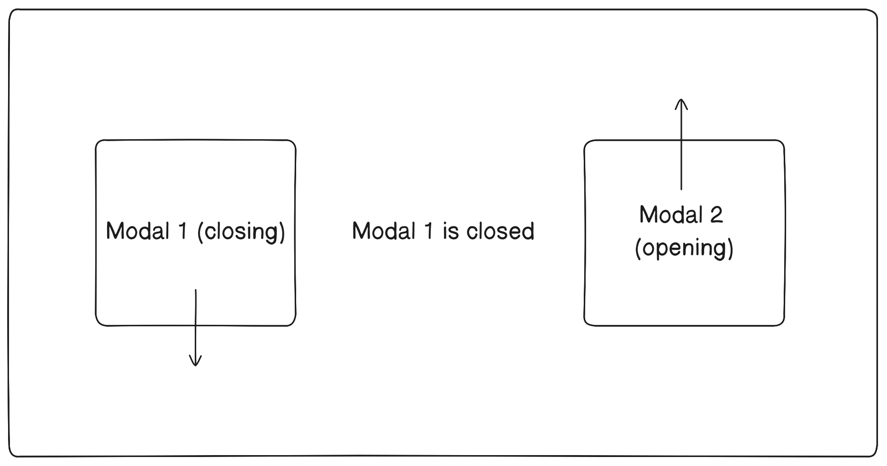

# React modal control

## Library that handles logic of modal windows in your React App

⚠ This library is responsible for the logic of managing modal windows and does not provide graphical elements for creating modal windows.
The author of the library decided to trust your taste and creativity ✨

---

Library is currently in alpha stage, so documentation is incompleted and may be changed in future

## Instalation

Using NPM

```bash
npm i react-modal-control
```

Using Yarn

```bash
yarn add react-modal-control
```

Using PNPM

```bash
pnpm add react-modal-control
```

## Setting up

Create a modal window component

```jsx
// Greeting.jsx

export const Greeting = () => {
  return (
    <div>
      <h2>Greeting</h2>
    </div>
  );
};
```

Create a file that will contain all modal windows within an object

```jsx
// modals.js

import { Greeting } from './Greeting.jsx';

const MODAL_WINDOWS = {
  greeting: Greeting,
};

export default MODAL_WINDOWS;
```

Wrap your app into `ModalWindowsProvider` and provide required options to provider

```jsx
import { ModalWindowsProvider } from 'react-modal-control';
import MODAL_WINDOWS from './modals';

function App() {
  return (
    <ModalWindowsProvider
      type="queue"
      appearenceMode="after-close"
      modals={MODAL_WINDOWS}
    >
      {/* rest */}
    </ModalWindowsProvider>
  );
}
```

After that define a place and wrap of modals uisng `ModalRenderer`

```jsx
import { ModalWindowsProvider, ModalRenderer } from 'react-modal-control';
import MODAL_WINDOWS from './modals';

function App() {
  return (
    <ModalWindowsProvider
      type="queue"
      appearenceMode="after-close"
      modals={MODAL_WINDOWS}
    >
      {/* rest */}

      <ModalRenderer>
        {(modal) => <div className="modal-window-wrapper">{modal}</div>}
      </ModalRenderer>
    </ModalWindowsProvider>
  );
}
```

The final step is to initialize useModal hook and we are ready to go

```jsx
// hooks/useModal.js

import { init } from 'react-modal-control';
import { MODAL_WINDOWS } from './modals';

const { useModal } = init(MODAL_WINDOWS);

export default useModal;
```

The main reason why the `useModal` hook needs to be created by calling the `init` function is to achieve additional
type safety for the first argument, which is the key of the modal window,
and options, including props, for the corresponding modal.
This allows achieving autocompletion, even when using JavaScript.

## useModal usage

You can open modal window from any place of your app by using `useModal` hook

```jsx
import useModal from './hooks/useModal';

function Menu() {
  const { open } = useModal();

  function handleClick() {
    // here you need to pass a key from MODAL_WINDOWS object
    open('greeting');
  }

  return (
    <div>
      <button onClick={handleClick}>Open greeting</button>
    </div>
  );
}
```

If modal window requires props you can provide it in options

```jsx
// Greeting.jsx

function Greeting({ name }) {
  return (
    <div>
      <h2>Hello, {name}</h2>
    </div>
  );
}

// Menu.jsx

function Menu() {
  const { open } = useModal();
  const [name, setName] = useState('');

  return (
    <div>
      <input
        type="text"
        placeholder="Enter your name"
        onInput={(event) => setName(event.target.value)}
        value={name}
      />
      <button onClick={() => open('greeting', { props: { name } })}>
        Greet me
      </button>
    </div>
  );
}
```

Also you can close **recent** opened modal window

```jsx
const { close } = useModal();

close();
```

If you want to close specified modal provide an id

```jsx
const { open, close } = useModal();

useEffect(() => {
  // open on component render
  const id = open('greeting');

  //close on rerender
  return () => close(id);
}, []);
```

To control modal window from inside of it you can use `useInternalModal`

```jsx
// Greeting.jsx
import { useInternalModal } from 'react-modal-control';

export const Greeting = () => {
  const { isActive, isClosing, closeSelf } = useInternalModal();
  return (
    <div>
      <button onClick={closeSelf}>Close</button>
      <h2>Greeting</h2>
    </div>
  );
};
```

## Animating your modal

If you want to animate modal before it will be closed you can use `useModalCapture` hook.
Modal window will be in closing stage until `release` call or component unmount.

```jsx
import { useModalCapture } from 'react-modal-control';

function ModalWithAnimation() {
  const [animate, setAnimate] = useState(false);

  const release = useModalCapture(() => setAnimate(true));

  return <FadeOutAnimation animate={animate} onAnimationEnd={release} />;
}
```

## Multiple captures for one modal window

In the event that multiple components are responsible for animations, you can set a delay for each of them.
The modal window will be closed after 2 seconds because it requires all components to release the modal window before closing it.

```jsx
import { useModalCapture, useInternalModal } from 'react-modal-control';

function Delay({ isClosing, timeout }) {
  const release = useModalCapture();

  useEffect(() => {
    if (isClosing) {
      const timeoutId = setTimeout(() => {
        release();
      }, timeout);

      return () => clearTimeout(timeoutId);
    }
  }, [isClosing]);

  return <p>Timout is: {timeout} ms</p>;
}

function Modal() {
  const { isClosing } = useInternalModal();

  return (
    <div>
      <Delay timeout={1000} isClosing={isClosing} />
      <Delay timeout={2000} isClosing={isClosing} />
    </div>
  );
}
```

⚠ However, it is not recommended to create a delay for each animation.
The best approach is to add a single delay to the topmost element of the modal window, after which all the window's contents become invisible,
eliminating the need for additional delays.

## Configure different screnarios for modals

It is possible to allow the simultaneous opening of multiple modal windows or configure the windows to open one after another.

This behavior is achieved by passing options to the `ModalWindowsProvider`.

### Multiple modal windows

```jsx
<ModalWindowsProvider type="multiple" modals={MODAL_WINDOWS}>
  {/* rest */}
</ModalWindowsProvider>
```

<p align="center">
  
</p>

In this case, all open windows are rendered. The most common way to display them is cascading, one behind the other.

### Queued modal windows

In the queue type, when multiple modal windows are triggered to open, they will be queued one after another,
with each new modal window appearing only after the previous one has been closed.
This approach ensures that users have a focused and sequential experience with the modal windows, without overlapping or obstructing views.

```jsx
<ModalWindowsProvider
  type="queue"
  appearenceMode="after-close"
  modals={MODAL_WINDOWS}
>
  {/* rest */}
</ModalWindowsProvider>
```

<p align="center">
  
</p>

---

`appearenceMode` may be configured as `after-close` or `during-close`

#### After close

When using the after-close management mode, the next modal window in the queue will only open after the currently open window has been completely closed.

<p align="center">
  
</p>

#### During close

The `during-close` mode allows the next modal window to be displayed while the previous one starts closing. This enables the creation of animations involving overlapping modal windows.

```jsx
<ModalWindowsProvider
  type="queue"
  appearenceMode="during-close"
  modals={MODAL_WINDOWS}
>
  {/* rest */}
</ModalWindowsProvider>
```

<p align="center">
  
</p>
